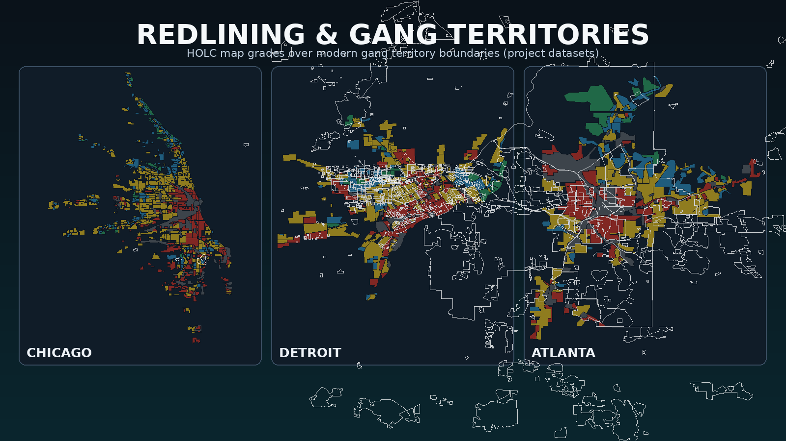

# Redlining & Gang Territories Mapping Project



A study of the correlation between historical HOLC redlining maps (1935-1940) and modern gang territories in major US cities.

## Live Maps

| City | View Map |
|------|----------|
| Los Angeles | [View Map](https://www.google.com/maps/d/viewer?mid=1f9kXu7qkxzbTnd1BbzxK6VN-nZc1J8M) |
| Chicago | [View Map](https://www.google.com/maps/d/viewer?mid=1LqYwXZFNvSH7wKGPNcBwC9QM2bqEnCE) |
| Detroit | [View Map](https://www.google.com/maps/d/viewer?mid=1g9PJvLWQNHqLOZvLVGfZZ6_hW6sPCzE) |
| Philadelphia | [View Map](https://www.google.com/maps/d/viewer?mid=1hB7Nw2Rb0mQVXYJqW_p5VcYQGJZwKvA) |
| Cleveland | [View Map](https://www.google.com/maps/d/viewer?mid=1iC8Ox3Sc1nRWYZKrX_q6WdZRHKaALwB) |
| Baltimore | [View Map](https://www.google.com/maps/d/viewer?mid=1jD9Py4Td2oSXZaLsY_r7XeaSILbBMxC) |
| Pittsburgh | [View Map](https://www.google.com/maps/d/viewer?mid=1kE0Qz5Ue3pTYabMtZ_s8YfbTJMcCNyD) |
| San Francisco | [View Map](https://www.google.com/maps/d/viewer?mid=1lF1Ra6Vf4qUZbcNua_t9ZgcUKNdDOzE) |
| New Orleans | [View Map](https://www.google.com/maps/d/viewer?mid=1mG2Sb7Wg5rVacdOvb_u0ahduLOeEPAF) |
| Atlanta | [View Map](https://www.google.com/maps/d/viewer?mid=1nH3Tc8Xh6sWbdeQwc_v1bieyMPfFQBG) |
| New York City | [View Map](https://www.google.com/maps/d/viewer?mid=1a6vAK2Ql0gGJxoNH_d1DttDG1dUsrLQ) |

**Note:** St. Louis map was not created due to gang territory file size exceeding Google My Maps' 5MB limit.

## Background

The Home Owners' Loan Corporation (HOLC) created "Residential Security" maps in the 1930s that graded neighborhoods:

- **Grade A (Green)** - "Best" - typically affluent, white neighborhoods
- **Grade B (Blue)** - "Still Desirable"
- **Grade C (Yellow)** - "Declining"
- **Grade D (Red)** - "Hazardous" - typically minority neighborhoods, denied loans

This practice, known as "redlining," systematically denied mortgage loans and investment to minority communities, creating concentrated poverty that persists today.

## Cities Covered

| City | HOLC Areas | Gang Data |
|------|------------|-----------|
| Los Angeles, CA | 417 | ✓ |
| Chicago, IL | 703 | ✓ |
| Detroit, MI | 239 | ✓ |
| Philadelphia, PA | 83 | ✓ |
| Cleveland, OH | 192 | ✓ |
| St. Louis, MO | 127 | ✓ |
| Baltimore, MD | 60 | ✓ |
| Pittsburgh, PA | 116 | ✓ |
| San Francisco, CA | 98 | ✓ |
| New Orleans, LA | 136 | ✓ |
| Atlanta, GA | 113 | ✓ |
| New York City, NY | 403 | ✓ |

## Findings: Redlining ↔ Gang Territory Correlation

`analyze_overlap.py` computes the spatial overlap between each city's gang
territories and its HOLC grades. Because the gang source data is uneven — some
cities are mapped as polygon **territories**, Chicago only as point **markers** —
two metrics are used: area overlap where polygons exist, point-in-polygon
otherwise.

To compare cities fairly, overlap is measured **within the HOLC-mapped
footprint only** (HOLC mapped select neighborhoods, and gang activity often
extends beyond them). The key column is the **D ratio**: the gang Grade-D share
divided by the city's *baseline* Grade-D share. A ratio above **1.0x** means
gang territory falls in historically redlined ("Hazardous") areas more than the
city's own redlining footprint would predict.

| City | Source | Grade C% | Grade D% | C+D% | Baseline D% | **D ratio** |
|------|--------|---------:|---------:|-----:|------------:|------------:|
| San Francisco | area | 15.0 | 85.0 | 100.0 | 30.6 | **2.78x** |
| Cleveland | area | 47.5 | 37.8 | 85.3 | 18.4 | **2.06x** |
| Baltimore | area | 36.4 | 25.4 | 61.8 | 14.6 | **1.74x** |
| Chicago | points | 52.8 | 44.4 | 97.2 | 27.1 | **1.64x** |
| Philadelphia | area | 27.8 | 41.4 | 69.2 | 27.0 | **1.53x** |
| St. Louis | area | 38.9 | 24.2 | 63.1 | 15.8 | **1.53x** |
| Pittsburgh | area | 52.3 | 38.7 | 91.0 | 26.6 | **1.45x** |
| Los Angeles | area | 57.7 | 31.3 | 89.0 | 22.0 | **1.42x** |
| New Orleans | area | 42.1 | 56.8 | 98.9 | 45.1 | **1.26x** |
| New York City | area | 59.5 | 32.7 | 92.2 | 29.7 | **1.10x** |
| Detroit | area | 46.7 | 31.1 | 77.8 | 28.4 | **1.09x** |
| Atlanta | area | 40.7 | 30.5 | 71.2 | 28.9 | **1.06x** |

**All 12 cities show a D ratio above 1.0** — gang territory concentrates in
historically redlined zones more than chance. The pattern is even starker for
grades **C+D combined** ("Declining" + "Hazardous"), which account for
**70–100%** of gang territory in every city, while Grade A ("Best") is near zero
everywhere.

**Caveats:** gang-territory maps are crowdsourced and unofficial; "redlined"
status here is the 1930s HOLC grade, a proxy for decades of disinvestment, not a
causal claim. San Francisco's 2.78x rests on a small in-footprint sample. Full
per-grade numbers (including area outside any HOLC zone) are in
[`analysis.csv`](./analysis.csv).

### Reproducing the analysis

```bash
pip install shapely lxml
python analyze_overlap.py   # writes analysis.csv + prints the summary table
```

## Data Sources

### Redlining Data
- [Mapping Inequality](https://dsl.richmond.edu/panorama/redlining/map) - University of Richmond

### Gang Territory Maps
| City | Source |
|------|--------|
| Los Angeles | [Gangs of Los Angeles](https://www.google.com/maps/d/u/0/viewer?mid=1ul5yqMj7_JgM5xpfOn5gtlO-bTk) |
| Chicago | [GangMap.com / r/Chiraqology](https://www.google.com/maps/d/viewer?mid=1xe7X8O0tiDRdJUNqG8IHEkcYaqyQOSs) |
| Detroit | [GangMap.com](https://www.google.com/maps/d/viewer?mid=1CqZGEDsnlpF0z7TZy8oGtxHo0q9uqNg) |
| Philadelphia | [Philly.Wiki](https://www.google.com/maps/d/viewer?mid=170j6JIjSRYraeh1xGf-auKlR6HnRuBo) |
| Cleveland | [r/StraightFromThaOH](https://www.google.com/maps/d/viewer?mid=1a3vq_epf5x8xi_Ja8OvUqWaWb7PUkas) |
| St. Louis | [GangMap.com](https://www.google.com/maps/d/viewer?mid=1BlP8dWqpsrwljeqkQGarSa57mbzJfq0) |
| Baltimore | [GangMap.com](https://www.google.com/maps/d/viewer?mid=1mpCVI7qXDuOes-4utDr2FK3HSsMbzRM) |
| Pittsburgh | [Community Map](https://www.google.com/maps/d/viewer?mid=1as3Dn6-Ecu69l66mU-5ifD0ycZk) |
| San Francisco | [OSINT Archives](https://www.google.com/maps/d/viewer?mid=1PD1YdFZWhv_-1o6ZulmPoLMkQAM) |
| New Orleans | [GangMap.com](https://www.google.com/maps/d/viewer?mid=1zeodrS0XnUt8IximIS9-pmx7OR8Dl8A) |
| Atlanta | [GangMap.com](https://www.google.com/maps/d/viewer?mid=1hMEvQwd1n9Jccxsy-1LzhwozIXkzpz8) |
| New York City | [GangMap.com](https://www.google.com/maps/d/viewer?mid=1CMk3O2D9HcjSdc8W5mepDj30JENpR48f) |

## Project Structure

```
redlining_project/
├── chrome-automation/           # Automation scripts
│   ├── create-city-maps.js     # Create Google My Maps per city
│   ├── download_gang_maps.py   # Download gang territory KMLs
│   ├── extract_major_cities.py # Extract HOLC data by city
│   └── *.js, *.py              # Other processing scripts
├── gang_territories/            # Gang territory KML files
│   └── {city}_gangs.kml
├── {city}_holc.geojson          # HOLC data per city (GeoJSON)
├── {city}_holc.kml              # HOLC data per city (KML with styling)
├── full_holc_data.json          # Complete HOLC dataset (all 239 cities)
└── README.md
```

## Chrome Automation Tools

### Setup

```bash
cd chrome-automation
npm install
```

### Creating City Maps

1. Start Chrome with remote debugging:
```cmd
"C:\Program Files (x86)\Google\Chrome\Application\chrome.exe" --remote-debugging-port=9222 --user-data-dir="D:\ChromeDebug"
```

2. Log into Google in that Chrome window

3. Run the map creator:
```cmd
node create-city-maps.js --all          # Create all city maps
node create-city-maps.js chicago        # Create single city map
```

### Data Processing Scripts

```bash
# Extract HOLC data for major cities from full dataset
python extract_major_cities.py

# Download gang territory KMLs from Google My Maps
python download_gang_maps.py
```

## Layer Limits

Google My Maps has a 10-layer limit per map. Each city map uses:
- 1 layer for HOLC redlining (all grades combined)
- 1 layer for gang territories

## License

Data sources retain their original licenses. This project is for educational and research purposes.
